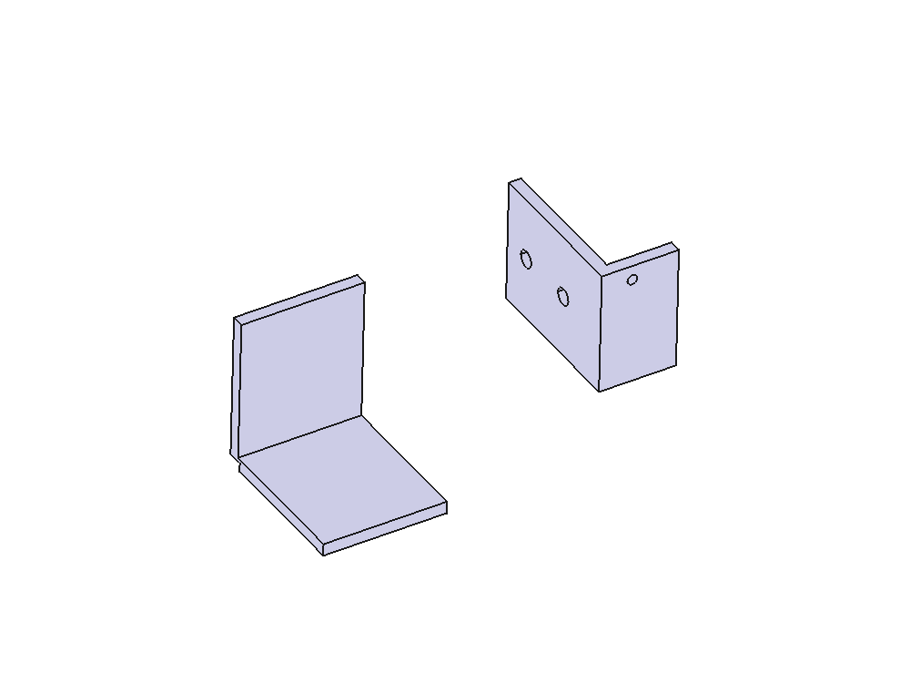

# Prusa Frame 6U Rack Mount Brackets

3D-printable brackets to mount standard 6U rack rails to a Prusa MK3S/MK4S 3D printer frame.



## Features

- **Non-destructive mounting** - Uses existing z-axis motor screw holes
- **Standard compatibility** - Fits EIA-310 6U (10.5") vertical rack rails
- **Centered positioning** - Rails centered in 275mm frame opening
- **Reinforced design** - Triangular angle braces for structural integrity
- **No supports needed** - Print-friendly geometry

## Quick Start

### Download STL Files

Download from the `stl/` directory:
- `top_bracket_left_v3.stl`
- `top_bracket_right_v3.stl`
- `bottom_bracket_left_v3.stl`
- `bottom_bracket_right_v3.stl`

### Print Settings

| Setting | Value |
|---------|-------|
| Material | PETG or ABS recommended |
| Layer height | 0.2mm |
| Infill | 40-50% |
| Perimeters | 3-4 |
| Supports | None |

### Hardware Required

| Item | Qty | Notes |
|------|-----|-------|
| M3 x 8mm screws | 10 | Frame mounting |
| M3 washers | 10 | Optional but recommended |
| 12-24 screws | 8-16 | Rail attachment |

## Bracket Specifications

### Top Brackets (2x)
- Dimensions: 45mm x 40mm x 97mm
- 2-hole linear mounting pattern
- Rail leg extends upward into frame

### Bottom Brackets (2x)
- Dimensions: 45mm x 40mm x 95mm
- 3-hole triangle mounting pattern
- Rail leg extends downward into frame

See [DESIGN.md](DESIGN.md) for detailed specifications.

## Assembly

1. Remove existing screws from Prusa frame z-axis motor mounts
2. Mount top brackets at upper frame corners
3. Mount bottom brackets at lower frame corners
4. Secure with M3 screws
5. Attach 6U rack rails using 12-24 screws
6. Verify alignment and tighten

## Files

```
prusa-rack-conversion/
├── README.md              # This file
├── DESIGN.md              # Detailed design documentation
├── LICENSE                # GNU GPL v3.0
├── prusa_rack_brackets.py # FreeCAD Python script
├── freecad/
│   └── BracketsV3.FCStd   # FreeCAD source file
├── stl/
│   ├── top_bracket_left_v3.stl
│   ├── top_bracket_right_v3.stl
│   ├── bottom_bracket_left_v3.stl
│   └── bottom_bracket_right_v3.stl
└── images/
    └── ...                # Reference images
```

## FreeCAD Source

The design was created in FreeCAD 0.21+ using the PartDesign workflow. The Python script `prusa_rack_brackets.py` contains parametric design code that can regenerate the brackets.

### Regenerating from Script

```python
# In FreeCAD Python console:
exec(open("prusa_rack_brackets.py").read())

# Or with STL export:
import prusa_rack_brackets
prusa_rack_brackets.create_all_brackets(export_dir="./stl")
```

## Compatibility

- **Frame:** Prusa MK3S, MK3S+, MK4S (and likely MK4 with similar frame)
- **Rails:** Any EIA-310 compliant 6U (10.5") vertical rack rails
- **FreeCAD:** Version 0.21+ with Python 3.11

## License

This project is licensed under the GNU General Public License v3.0 - see [LICENSE](LICENSE) for details.

## Contributing

Contributions welcome! Please feel free to submit issues or pull requests.

## Author

Created by [adbyrne](https://github.com/adbyrne)

---

*This design was developed with AI assistance using Claude Code.*
